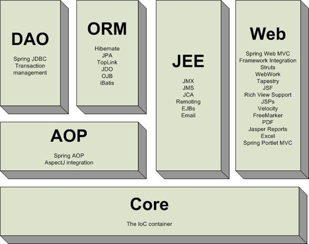

### Spring（一）：入门

1. Spring是控制反转（IOC）和面向切面（AOP）框架

2. 优点：

   * 低侵入式的
   * DI有效降低耦合
   * AOP集中管理
   * ORM和DAO简化对数据库的访问

3. 核心模块

   核心容器： 工厂

   应用上下文：写读

   AOP模块：事务管理服务

   JDBC和DAO：数据库连接

   ORM：对象实体映射

   Web，MVC

   