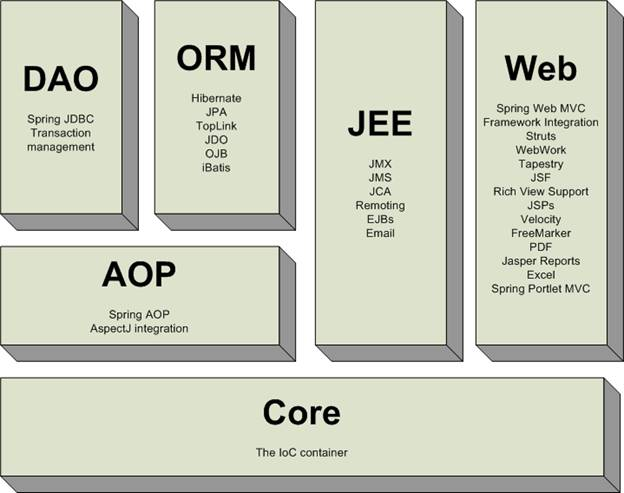

### Spring（一）：入门

1. Spring是控制反转（IOC）和面向切面（AOP）框架

2. 优点：

   * 低侵入式的
   * DI有效降低耦合
   * AOP集中管理
   * ORM和DAO简化对数据库的访问

3. 核心模块

   核心容器： 工厂

   应用上下文：写读

   AOP模块：事务管理服务

   JDBC和DAO：数据库连接

   ORM：对象实体映射

   Web，MVC

   

4. IOC和AOP初步理解

   1. IOC

      - IOC控制反转：说的是创建对象实例的控制权从代码控制剥离到IOC容器控制，实际就是用户在xml文件里控制，侧重于原理。
      - DI依赖注入：说的是创建对象实例时，为这个对象注入属性值或对象实例，侧重于实现。

   2. AOP

      - 分离一些行为，不影响业务逻辑处理。 用声明的方式模块化一些组件。

        专门用于处理模块中的交叉关注点，常常用AOP来处理一些具有横切性质的系统级服务，如失物管理，安全检查，缓存，对象池管理等。

           代理对象的方法=增强效果+被代理对象的方法

        - 定义普通业务组件
        - 定义切入点
        - 定义增强处理

      - 关键概念

        - 切面：关注点的模块化，关注点可能横切多个对象（切面类：日志类）

        - 连接点：程序执行过程中的特定的点，比如某方法调用的时候

        - 通知：切面特定连接点上执行的动作（before,after）。以连接器做通知模型，维护一个以连接点为中心的拦截器链。

        - 切入点：匹配连接点的断言。通知和一个切入点表达式并联并在满足这个连接点的切入点上运行。

          连接点如何和切入点的表达式匹配是spring是核心

        - 引入：用来给一个类型声明额外的方法和属性

        - 目标对象：被一个或多个切面所通知的对象

        - AOP代理：AOP框架创建的对象，用来实现切面契约

        - 织入：把切面连接到其他的应用程序类型或对象，创建一个被通知的对象。