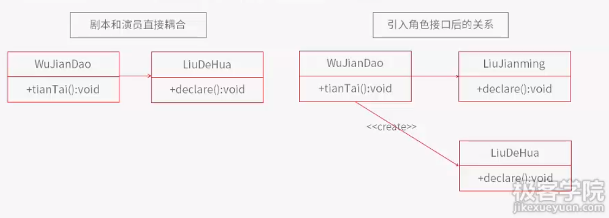

### 3. Spring（三）：开发包及示例

1. 安装包下载路径

   https://repo.spring.io/release/org/springframework/spring/

2. 开发包内容介绍

   * 核心包
     * Spring Core：工具类，核心（都要用到）
     * Spring Beans： 配置文件，创建管理Bean， 依赖注入和控制反转（都要用到）
     * Spring AOP：AOP特性
     * Spring Context：为核心提供扩展
   * 辅助开发包

3. 项目示例

   * 项目结构

     

   * 创建过程

     

   * XML配置

     ```xml
     <?xml version="1.0" encoding="UTF-8"?>
     <!DOCTYPE beans PUBLIC "-//SPRING/DTD BEAN/EN" "http://www.springframework.org/dtd/spring-beans.dtd">
     <beans>
         <bean id="HelloWorld" class="HelloMessage.HelloWorld"></bean>
         <bean id="HelloChina" class="HelloMessage.HelloChina"></bean>
         <bean id="person" class="HelloMessage.Person">
             <property name="helloMessage" ref="HelloWorld"></property>
         </bean>
     </beans>
     ```

     ​

     ​