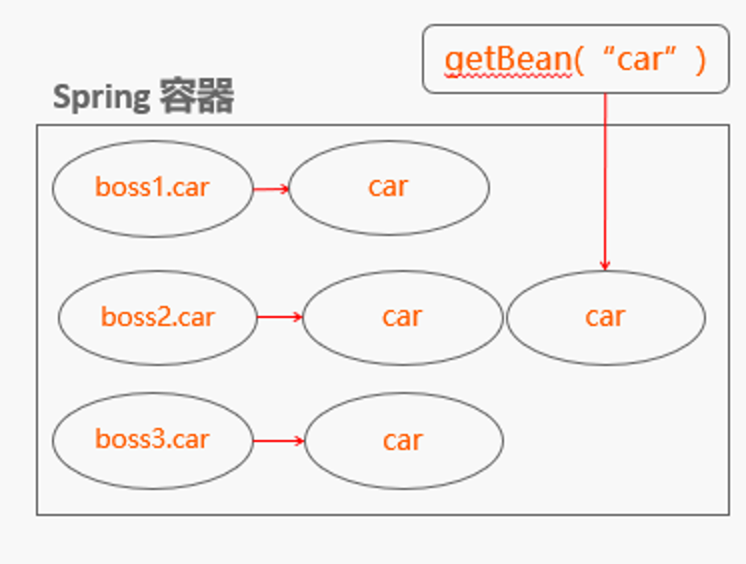

### 4. Spring（四）深入理解IoC

IoC 是 Spring容器的内核，AOP、声明式事务等功能都依赖于此功能

1. 解耦过程实例

   * 问题场景

     

   * 解耦过程

     

   * IoC解耦

     * 接口具体实现类的控制权从调用类移除，转交到第三方决定

       例如场景中：

       * 控制：选择刘建明角色扮演者的控制权
       * 反转：控制权从剧本中移除，转交到了导演手中

       

2. IoC注入

   * 构造函数注入

     通过调用类的构造函数，将接口实现通过构造函数变量传入

     

   * 属性注入

     （用到的时候才注入，比构造函数注入节约）

     

   * 接口注入

     （增加类的数量，和属性注入本质区别不大，所以不提倡）

     

   * Spring 配置示例

     

3. Java反射机制

   * ClassLoader

     类装载器就是寻找类的字节码文件并构造出类在JVM内部表示的对象组件，主要工作由ClassLoader及其子类负责，ClassLoader是一个重要的Java运行时系统组件，它负责在运行时查找和装入Class字节码文件。

     * 工作机制

       1. 装载：查找和导入Class文件
       2. 链接：执行校验，准备和解析步骤
       3. 初始化：对类的静态变量，静态代码块执行初始化工作

     * ClassLoader之间的关系

       ```java
       public static void main(String[] args) {
               ClassLoader loader=Thread.currentThread().getContextClassLoader();
               System.out.println("current loader: "+loader);
               System.out.println("parent loader: "+loader.getParent());
               System.out.println("grandparent loader: "+loader.getParent().getParent());
       }

       current loader: sun.misc.Launcher$AppClassLoader@18b4aac2
       parent loader: sun.misc.Launcher$ExtClassLoader@5451c3a8
       grandparent loader: null   （根装载器，非java编写，无法显示出来）

       ```

     * 重要方法

       ```java
       Class loadClass(String name)  //name类装载器需要装载的类的名字
       Class defineClass(String name,byte[]b,int off ,int len)//字节数组装换成java.lang.class 对象
       Class findSystemClass(String name)   //从本地文件系统载入class文件
       Class findLoadedClass(String name)   //查看classloader是否已经装入到某个类中
       ClassLoader getParent()//类装载器的父装载器除了根装载器 其他类装载器都有且仅有一个父装载器

       ```

   * 重要的反射类

     * Constructor： 类的构造函数的反射类，获得类的所有构造函数
     * Method：方法的反射类
       * getReturnType()
       * getParameterType()
       * getExceptionType()
       * getParameterAnnotations()
     * Field：类的成员变量的反射类

   * Java反射与IoC的关系

     

     ​

