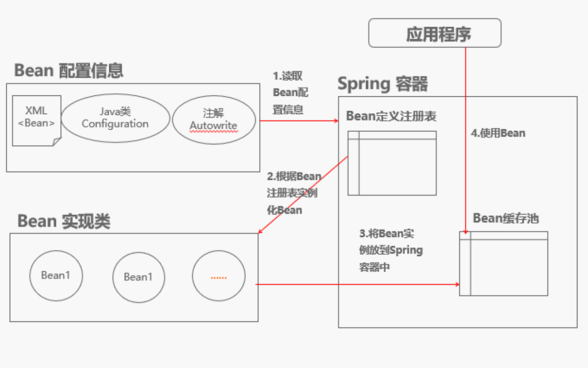
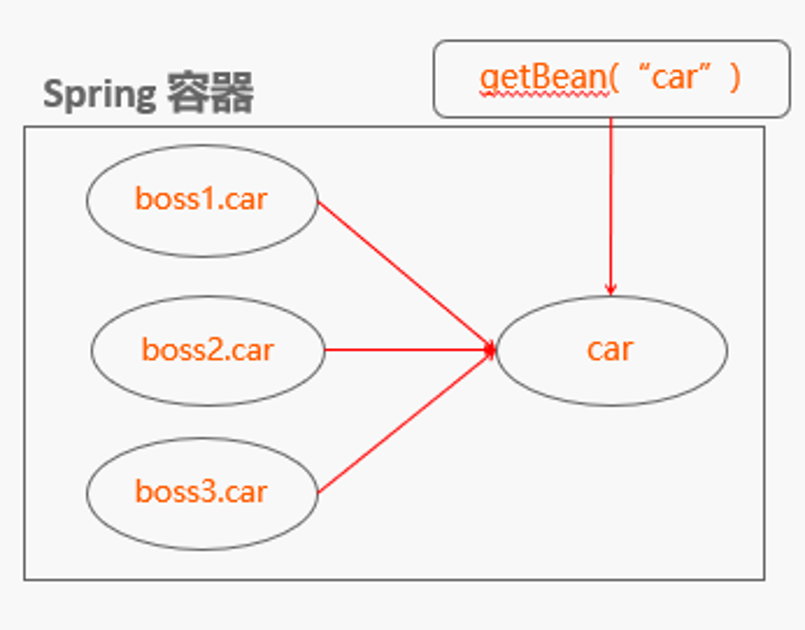

### 4. Spring（四）：配置文件浅析

1. 概述

   Spring 的配置文件是用于指导 Spring 工厂进行 Bean 的生产、依赖关系注入及 Bean 实例分发的"图纸”，它是一个或多个标准的XML文档

   * 配置文件示例

     ```xml
     <beans>
         <import  resource="resource1.xml” />   （加载多个配置文件）
         <import  resource="resource2.xml” />
         <bean id="bean1” class="***”></bean>
         <bean name="bean2” class="***”></bean>
         <alias alias="bean3” name="bean2” />    (别名)
     </beans>

     ```

   * Spring高层视图

     * Spring容器启动基本条件
       * Spring框架包
       * Bean配置信息
       * Bean实现类
     * Bean的元数据信息
       * 实现类
       * 属性信息
       * 依赖关系
       * 行为配置
       * 创建方式

     

   * 基于XML的配置

     ​

2. Bean的命名（示例 note_4/definition ）

   * Bean id的命名方式

     Bean可以有一个或多个id，第一个id称为"标识符”，其余叫做别名

     * 示例1 配置全限定类名，唯一
     * 示例2 指定id，唯一
     * 示例3 指定name，唯一
     * 示例4 同时指定id和name
     * 示例5 指定多个name
     * 示例6 指定别名 唯一

   * 为什么id和name共存

     id是唯一的，可以解析xml判断是否存在

     name在运行时才可以判断是否存在

   * 命名约定

     * 遵循xml命名规范
     * 字母数字下划线
     * 驼峰式

3. Bean的实例化

   * 比较

     * 传统方法：new和反射
     * Spring IoC：配置元数据使用反射机制

   * IoC创建实例的方式

     * 使用构造器实例化Bean：默认构造器和有参数构造器
     * 使用静态工厂方法实例化Bean：制定必需的class和factoryMethod，允许指定方法参数
     * 使用实例工厂方法实例化Bean：不能指定class属性，必须使用factoryBean指定工厂Bean，factoryMethod指定实例化Bean的方法

   * 具体示例（note_4/instance）

     * 构造器实例化

       构造器实例化 Bean 是最简单的方式，Spring IoC容器既能使用默认空构造器也能使用有参数构造器两种方式创建Bean，如以下方式指定要创建的Bean类型

       ```xml
       1. 空构造器实例化：
       <bean id="helloServiceNoWithArgs" class="com.***.HelloWorldImpl" />

       2. 有参数构造器实例化：
       <bean id="helloServiceWithArgs" class=" com.***.HelloWorldmpl">
           <!-- 指定构造器参数 -->  
           <constructor-arg index="0" value="Hello Spring!"/>  
       </bean>

       ```

     * 静态工厂实例化

       使用静态工厂的方式除了指定必须的class属性，还要指定factory-method属性来指定实例化Bean的方法，而且使用静态工厂方法也允许指定方法参数，Spring IoC容器将调用此属性指定的方法来获取Bean，配置如下：

       ```xml
       <!--使用有参数构造参数-->  
       <bean id="helloServiceStaticFactory" class="com.***.HelloWorldStaticFactory" factory-method="newInstance">
                 <!-- 指定构造器参数 -->  
                <constructor-arg index="0" value="Hello Static Factory!"/>  
       </bean>

       ```

     * 实例工厂实例化

       使用实例工厂方式不能指定class属性，此时必须使用factory-bean属性来指定工厂Bean，factory-method属性指定实例化Bean的方法，而且使用实例工厂方法允许指定方法参数，方式和使用构造器方式一样，配置如下：

       ```xml
        <!-- 1、定义实例工厂Bean -->
       <bean id="beanInstanceFactory" class="note_4.instance.HelloWorldInstanceFactory" />
           <!-- 2、使用实例工厂Bean创建Bean -->
          <bean id="helloWorldInstance" factory-bean="beanInstanceFactory"  factory-method="newInstance">
              <constructor-arg index="0" value="Hello Instance Factory!"></constructor-arg>
          </bean>
       </beans>

       ```

4. Bean的作用域

   Spring Bean 中所说的作用域，在配置文件中即是"scope”。在面向对象程序设计中一般指对象或变量之间的可见范围。而在Spring容器中是指其创建的Bean对象相对于其他Bean对象的请求可见范围

   * 作用域的类型与配置

     在Spring 容器当中，一共提供了5种作用域类型，在配置文件中，通过属性scope来设置bean的作用域范围。

     ```xml
     singleton，只会存在一个共享的bean实例，存储在单例缓存中
     <bean id="userInfo" class="com.UserInfo" scope="singleton"></bean>

     prototype：有状态的bean使用prototype，每次请求该bean，都会创建一个新的
     <bean id="userInfo" class="com.UserInfo" scope=" prototype "></bean>

     request：针对每一次的http请求，根据该bean定义创建全新的实例，仅在当前http请求范围内有效
     <bean id="userInfo" class="com.UserInfo" scope=" request "></bean>

     session：类似request
     <bean id="userInfo" class="com.UserInfo" scope=" session "></bean>

     global session：
     <bean id="userInfo" class="com.UserInfo"    scope="globalSession"></bean>

     ```

     * singleton

       singleton作用域是指在Spring IoC容器中仅存在一个Bean的示例，Bean以单实例的方式存在，单实例模式是重要的设计模式之一，在Spring中对此实现了超越，可以对那些非线程安全的对象采用单实例模式

       ```xml
       singleton的配置方式：
       1. <bean id="car" class="com.Car" scope="singleton"></bean>
       2. <bean id="boss1" class="com.Boss" p:car-ref="car"></bean>（引用了car）
       3. <bean id="boss2" class="com.Boss" p:car-ref="car"></bean>（引用了car）
       4. <bean id="boss3" class="com.Boss" p:car-ref="car"></bean>（引用了car） 
       ```

       （缓存的形式存在，会提前实例化，方便提前发现问题，同时因为被缓存，多次使用的时候节约时间）

       

     * prototype

       prototype作用域是指每次从容器中调用Bean时，都返回一个新的实例，即每次调用getBean()时，相当于执行new Bean()的操作。在默认情况下，Spring容器在启动时不实例化prototype的Bean：

       ```xml
       prototype的配置方式：
       1. <bean id="car" class="com.Car" scope="prototype"></bean>
       2. <bean id="boss1" class="com.Boss" p:car-ref="car"></bean>
       3. <bean id="boss2" class="com.Boss" p:car-ref="car"></bean>
       4. <bean id="boss3" class="com.Boss" p:car-ref="car"></bean>

       ```

       

     * request,session和globalSession

       当用户使用Spring的WebApplicationContext时，还可以使用另外3种Bean的作用域，即request,session和globalSession。在使用Web应用环境相关的Bean作用域时，必须在Web容器中进行一些额外的配置：

       ```xml
       低版本Web容器配置：
       <filter>  
           <filter-name>requestContextFilter</filter-name>  
           <filter-class>org.springframework.web.filter.RequestContextFilter</filter-class>  
       </filter>  
       <filter-mapping>  
           <filter-name>requestContextFilter</filter-name>  
           <servlet-name>/*</servlet-name>  
       </filter-mapping> 
       高版本Web容器配置：
       <listener> <listener-class>
           org.springframework.web.context.request.RequestContextListener
       </listener-class></listener>
       ```

     * 实例(note_4/scope)

     * 自定义作用域

       在Spring 2.0中，Spring的Bean作用域机制是可以扩展的，这意味着，你不仅可以使用Spring提供的预定义Bean作用域，还可以定义自己的作用域，甚至重新定义现有的作用域（不提倡这么做，而且你不能覆盖内置的singleton和prototype作用域）

       ```java
       //实现自定义Scope类: 
       org.springframework.beans.factory.config.Scope
       //注册自定义Scope类: 
       ConfigurableBeanFactory.registerScope(String scopeName, Scope scope)
       //使用自定义的Scope: 
       Scope customScope = new ThreadScope();
       beanFactory.registerScope(“thread”, customeScope);
       <bean id="***" class="***"  scope=“scopeName” />
       ```

5. 配置文件的整合

   * 当存在多个配置文件时

     * Spring-Common.xml位于common文件夹下
     * Spring-Connection.xml位于connection文件夹下
     * Spring-Module.xml位于module文件夹下

   * 传统加载方法

     ```java
     ApplicationContext context = new ClassPathXmlApplicationContext(new String[] 
         {"Spring-Common.xml","Spring-Connection.xml","Spring-ModuleA.xml"});

     ```

   * 整合配置文件：Spring-All-Module.xml

     ```xml
     <beans .....>

         <importresource="common/Spring-Common.xml"/>

         <importresource="connection/Spring-Connection.xml"/>

         <import resource="module/Spring-Module.xml"/>

     </beans>

     ```

   * 整合后加载

     ```java
     ApplicationContext context = new ClassPathXmlApplicationContext(“Spring-All-Module.xml”);
     ```

     ​