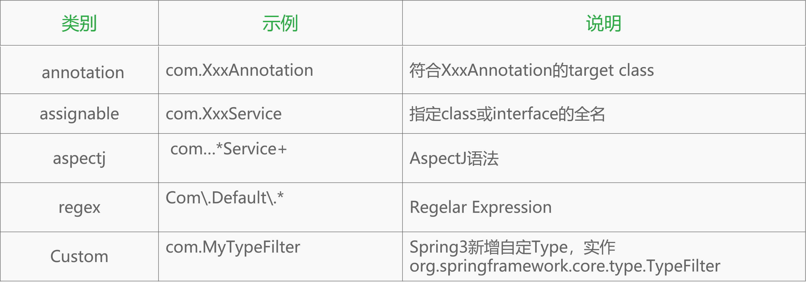
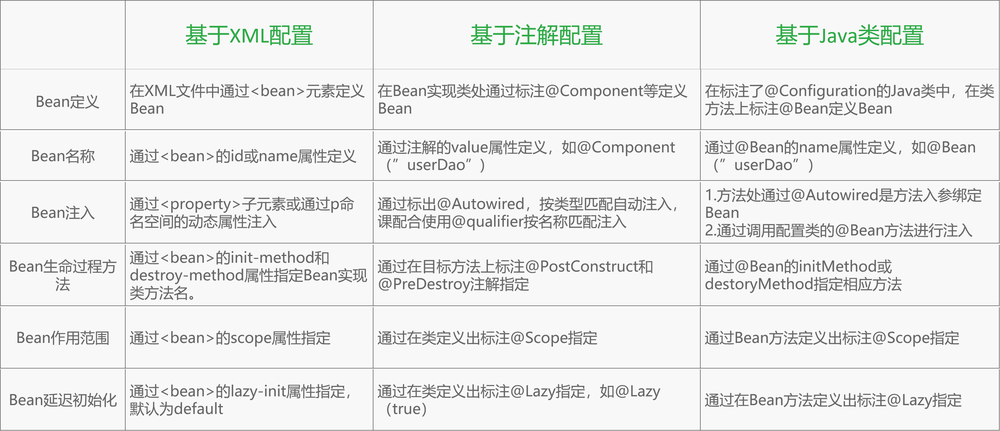
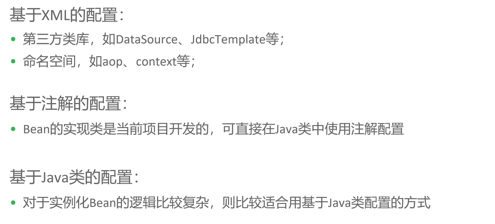

### 5. Spring：简化Spring XML配置

1. 总览

   * 自动装配Bean的属性
     * 有助于减少和消除property，constructor argument等元素
   * 基于注解的配置
     * 类的注解
   * 基于Java类的配置
     * 几乎不适用xml，使用纯粹的xml

2. 自动装配Bean的属性

   当Spring装配Bean的属性时，如果非常明确，则可以使用自动装配模式

   * 自动装配类型

     * byName

       把与Bean的属性具有相同名字或者id的其他的Bean自动装配到Bean对应的属性当中

     * byType

       把与Bean的属性具有相同类型的其他的Bean自动装配到Bean对应的属性当中

     * constructor

       与Bean的构造的入参具有相同类型的其他的Bean自动装配到Bean对应构造器的入参当中

     * autodetect

       尝试使用constructor再尝试byType

     示例：

     * 默认情况下，不自动装配，通过"ref"标签手动设定

       类文件：

       ```java
        public class Customer 
       {
           private  Person  person;
           public void setPerson(Person person) {
               this.person = person;
           }
       }

       public class Person {……}

       ```

       配置文件：

       ```xml
       <bean id="customer" class="Customer">
         		<!--property 通过ref显式配置-->
           	<property name="person" ref="person" />	
       </bean>

       <bean id="person" class="Person" />
       ```

     * byName自动装配

       ```xml
       <!--遵循约定为属性自动装配id与该属性名字相同的bean，通过设置autowire="byName" spring特殊对待customer的所有属性，去寻找id与该属性名字相同的bean-->
       <bean  id="customer" class="Customer" autowire="byName" /> 
       <bean  id="person" class="Person" />
       <!--person类的id属性与customer的person属性的名字是一样的-->
       ```

     * byType自动装配

       ```xml
       <!--设置为byType以后，spring会查找哪一个bean的类型与person的类属性相匹配-->
       <!--设置为byType以后，只允许存在一个bean与需要匹配的类型相匹配-->
       <bean id="customer" class="Customer" autowire="byType" /> 
       <bean id="person" class="Person"  />

       <!--为了消除歧义，可以设置某些bean作为首选类，也可以取消某些类的候选资格-->
       <bean id="customer" class="Customer" autowire="byType" /> 
       <bean id="person1" class="Person"  primary="false" />

       <bean id="customer" class="Customer" autowire="byType" /> 
       <bean id="person2" class="Person"  autowire-candidate="false" />
       ```

     * constructor自动装配

       ```xml
       <!--类似byType，发现多个Bean匹配入参的时候会抛出异常-->
       <bean id="customer" class="Customer" autowire="constructor" /> 
       <bean id="person" class="Person"  />
       ```

     * autodetect自动装配

       ```xml
       <bean id="customer" class="Customer" autowire="autodetect" /> 
       <bean id="person" class="Person"  />
       ```

   * 默认自动装配

     当Spring要为它所创建的所有Bean应用相同的自动装配策略来简化配置时，可以在根元素<bean>上增加一个default-autowire属性

     bean元素的autowire可以覆盖根元素的

     * 示例

       ```xml
       <beans    xmlns="http://www.springframework.org/schema/beans"
       	           xmlns:xsi="http://www.w3.org/2001/XMLSchema-instance" 
       	            xsi:schemaLocation="http://www.springframework.org/schema/beans
       	            http://www.springframework.org/schema/beans/spring-beans-3.0.xsd"
                 default-autowire="byType"  >
                            …………………
       </beans>
       ```

   * 混合装配

     当我们对某个Bean选择了自动装配策略时，仍然可以为任意一个属性配置`<property>`属性，即可以同时使用自动装配和显式装配策略：

     * 示例

       ```xml
       <bean id="customer" class=".Customer" autowire="byType" >
             <property name="person" ref="person1" />
       </bean>
       <bean id="person"  class="Person" />
       <bean id="person1" class="Person" />
       ```

       ```xml
       <bean id="customer" class="Customer" autowire="byType" >
             <property name="person" > <null/> </property>
       </bean>
       <bean id="person"   class="Person" />
       <bean id="person1"  class="Person" />

       ```

     * 注意

       constructor自动装配时，必须让spring自动装配构造的所有入参，不能混合使用constructor自动装配和argument属性

3. 基于注解的配置

   Spring2.0开始引入基于注解的配置方式，即Bean的定义信息可以通过在Bean的实现类上标注注解实现

   更细粒度，减少xml的配置文件

   * 注解配置示例

     @Component 是Spring容器中的基本注解，表示容器中的一个组件（bean），可以作用在任何层次，下面的示例介绍该注解的使用方法

     * 注解配置示例

       ```java
       @Component("userDao")
       public class UserDao {  ……  }
       ```

     * 等效的XML配置

       ```xml
       <bean id="userDao" class="UserDao"/>
       ```

     * 可用作定义Bean的注解

       针对特殊类有特殊功能

       ```java
       @Component
       @Controller
       @Repository
       @Service
       ```

   * 加载注解配置

     Spring在2.5后提供了一个context的命名空间，它提供了通过扫描类包来加载利用注解定义的Bean的方式

     ```xml
     <?xml version="1.0" encoding="UTF-8"?>    
     <beans xmlns="http://www.springframework.org/schema/beans"    
                     xmlns:xsi="http://www.w3.org/2001/XMLSchema-instance"    
                     xmlns:context="http://www.springframework.org/schema/context"    ①       
                     xsi:schemaLocation="                             http://www.springframework.org/schema/context/spring-context-3.0.xsd">    
       
                    <context:component-scan   base-package="com.jike.spring"/>   ② 
     </beans> 

     ```

     * 过滤扫描特定类的注解

       1. resource-pattern

          ```xml
          <context:component-scan  base-package="spring" resoure-pattern="a/*.class"/>
          ```

       2. 过滤子元素

          ```xml
          <context:component-scan   base-package="com" >
              <context:include-filter type="regex" expression="com.spring.*"/>
              <context:exclude-filter type="aspectj" expression="com.*Controller+"/>
          </context:component-scan>
          ```

       3. 过滤表达式

          

   * 常用注解配置

     Spring 3.0 提供了一系列的针对依赖注入的注解，这使得 Spring IoC 在 XML 文件之外多了一种可行的选择

     * Bean的定义注解

       Spring 自 2.0 开始，陆续引入了一些注解用于简化 Spring 的开发。@Repository 注解便属于最先引入的一批，用于将数据访问层 (DAO 层 ) 的类标识为 Spring Bean：

       ①  使用 @Repository 将 DAO 类声明为 Bean 

       ```java
       @Repository 
       public class UserDaoImpl  implements  UserDao{ …… } 
       ```

       ② 在 XML 配置文件中启动 Spring 的自动扫描功能

       ```xml
       <beans … > 
         	 <context:component-scan base-package=“com.jike.dao” /> 
           	       ……
       </beans>
       ```

       * Spring 2.5 在 @Repository 的基础上增加了功能类似的额外三个注解，共有如下四种注解：

         @Component ：一个泛化的概念，表示一个组件 (Bean) ，可作用在任何层次；

         @Repository：用于对DAO实现类进行标注；

         @Service： 用于对Service实现类进行标注；

         @Controller ：用于对Controller实现类进行标注；

         ```xml
         <beans ...> 
          	<context:component-scan  base-package="com"
          	   name-generator="com.SimpleNameGenerator"/> 
          </beans>
          
         ```

     * Bean的生命周期注解

       在某些情况下，可能需要我们手工做一些额外的初始化或者销毁操作，例如资源的获取和释放操作，Spring 1.x 为此提供了两种方式供用户指定执行生命周期回调的方法：

       * 实现 Spring 提供的两个接口：InitializingBean 和 DisposableBean（不推荐 代码要加接口 增加耦合度）
       * 在 XML 文件中使用 <bean> 的 init-method 和 destroy-method 属性

       ```xml
       <bean  id="userService"   class="com.***.UserService" 
                       init-method="init"  destroy-method="destroy"> 
       </bean> 
        
       ```

       Spring 2.5 在保留以上两种方式的基础上，提供了对 JSR-250 的支持。JSR-250 规范定义了两个用于指定声明周期方法的注解：

       * @PostConstruct：初始化之后执行的回调方法
       * @PreDestroy：销毁之前执行的回调方法 

       注解示例说明：

       ```java
       public class PersonService {  
           @PostConstruct  
           public void  init(){  ……}  
           @PreDestroy  
           public void  dostory(){  …… }  
       } 
       ```

       配置文件示例说明：

       ```xml
        <context:annotation-config />
       ```

     * Bean的依赖检查注解

       Spring 2.0之前使用 dependency-check 在配置文件中设置，属性用于进行依赖检查，缺点是粒度较粗；该属性的取值包括以下几种：

       * none -- 默认不执行依赖检查
       * simple -- 对原始基本类型和集合类型进行检查
       * objects -- 对复杂类型进行检查
       * all -- 对所有类型进行检查

       使用 Spring2.0 提供的 @Required 注解，提供了更细粒度的控制，@Required 注解只能标注在 Setter 方法之上：（只在作用在set方法上，只关注是否被调用，不关注设置了什么值，可以为null，在非set方法上会被忽略）

       ```xml
        <context:annotation-config />
       ```

     * Bean的自动装配注解

       * @Autowired可以对成员变量、方法和构造函数进行标注，来完成自动装配的工作，它根据类型进行自动装配，如需按名称进行装配，则需要配合@Qualifier使用：

         默认按照类型来进行匹配

         ```java
         //@Autowired示例：
         @Service
         public class LogonService {
         	@Autowired
         	private LogDao logDao;
           	//有且仅有一个 类型匹配 否则异常
         }
          
         //required示例：
         public class LogonService {
           //找不到类型匹配自动注入，不要抛出异常
         	@Autowired（required=false）
         	private LogDao logDao;
         }
          
         //@Qualifier示例：
         public class LogonService {
           //有一个以上的类型匹配，通过名称匹配
         	@Autowired
         	@Qualifier("userDao")
         	private UserDao userDao;
         }
         ```

       * @Autowired可以对类成员变量以及方法的入参进行标注，如下所示

         @Autowired标注方法入参示例:

         ```java
         public class LogonService {
              @Autowired
              public void setLogDao(LogDao logDao) {
                       this.logDao = logDao;
               }
              @Autowired
              @Qualifier("userDao") 
              public void setUserDao(UserDao userDao) {
                       this.userDao = userDao;
               }
         }
          
         ```

       * @Qualifier用于方法入参示例：

         ```java
         @Autowired
         public void init(@Qualifier("userDao")UserDao userDao) {
         	this.userDao = userDao;
         }
          
         ```

       * @Autowired可以对类中集合类的变量或方法入参进行标注，此时会将容器中类型匹配的所有Bean都自动注入进来，如下所示：

         @Autowired标注集合入参示例：

         ```java
         public class LogonService {
         	@Autowired(required=false)
         	public List<Plugin> plugins;
         	public List<Plugin> getPlugins() {
         		return plugins;
         	}
         }
         ```

4. 基于Java类的配置

   基于Java类定义Bean配置元数据，其实就是通过Java类定义Spring配置元数据，且直接消除XML配置文件：

   * 基于Java类得到配置示例(note_5)

     * @Configuration注解介绍

     * @Bean注解相应的方法

     * AnnotationConfigApplicationContext或子类进行加载

       ApplicationContextConfig.java

       ```java
       @Configuration
       public class ApplicationContextConfig {
           @Bean
           public String message(){
               return "Hello world";
           }
       }
       ```

       ConfigurationTest.java

       ```java
       public class ConfigurationTest {
           public static void main(String[] args) {
               AnnotationConfigApplicationContext ctx=
                       new AnnotationConfigApplicationContext(ApplicationContextConfig.class);
               System.out.println(ctx.getBean("message"));

           }
       }
       ```

   * @Configuration注解介绍

     通过@Configuration注解的类将被作为配置类使用，表示在该类中将定义Bean配置元数据，且使用@Configuration注解的类本身也是一个Bean，使用方式如下所示：

     ```java
     @Configuration("ctxConfig")  
     public class ApplicationContextConfig {  
         ……  
     }

     ```

   * @Bean注解介绍

     过@Bean注解配置类中的相应方法，则该方法名默认就是Bean名，该方法返回值就是Bean对象，并定义了Spring IoC容器如何实例化、自动装配、初始化Bean逻辑，具体使用方法如下：

     @Bean注解格式

     ```java
     @Bean(name={},  
           autowire=Autowire.NO,  
           initMethod="",  
           destroyMethod="") 

     ```

     @Bean注解示例

     不能使private，static，final

     ```java
     @Bean
     public String message() {
         return new String("hello");
     }

     ```

     等价XML配置

     ```java
     <bean id="message" class="java.lang.String">  
         <constructor-arg index="0" value="hello"/>  
     </bean> 
     ```

   * 结合基于Java和基于XML的配置

     基于Java方式的配置方式不是为了完全替代基于XML方式的配置，两者可以结合使用，因此可以有两种结合使用方式：

     * 在基于Java方式的配置类中引入基于XML方式的配置文件

       ```xml
       <bean id="message" class="java.lang.String">  
           <constructor-arg index="0" value="test"></constructor-arg>  
       </bean> 

       ```

       ```java
       @Configuration("ctxConfig")   
       @ImportResource("classpath:appCtx.xml")  
       public class ApplicationContextConfig {  
       	……  
       } 

       ```

     * 在基于XML方式的配置类中引入基于Java方式的配置文件

       ```xml
       <context:annotation-config/>  
       <bean id="ctxConfig" class=“.ApplicationContextConfig"/> 
       ```

       ```java
       public void testXmlConfig() {  
               String configLocations[] = {"classpath:appCtx.xml"}; 
               ApplicationContext ctx = new ClassPathXmlApplicationContext(configLocations);  
                ……
       } 

       ```

   * 启动Spring容器

     Spring提供了一个AnnotationConfigApplicanContext类，能够直接通过标注@Configuration的Java类启动Spring容器：

     * 通过构造函数加载配置类:

       ```java
       ApplicationContext ctx = new AnnotationConfigApplicationContext(AppConf.class);

       ```

     * 通过编码方式注册配置类：

       ```java
       AnnotationConfigApplicationContext ctx = new AnnotationConfigApplicationContext();
       ctx.register(DaoConfig.class);
       ctx.register(ServiceConfig.class);
       ctx.refresh();

       ```

     * 引入多个配置类：

       ```java
       @Configuration
       @Import(DaoConfig.class)
       public class ServiceConfig  {……}
       ```

5. 不同配置方式比较

   

   

   ​