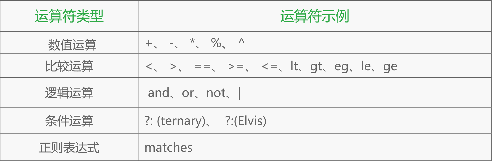
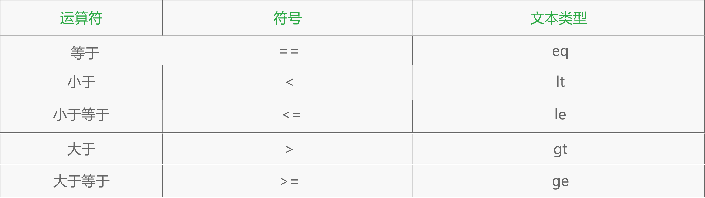
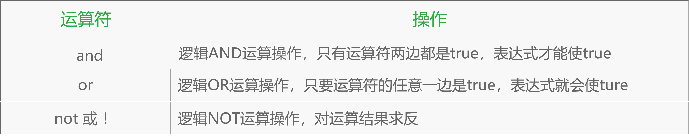

### 7. Spring：表达式语言

1. Spring 表达式语言的入门介绍

   * 基本概述

     Spring表达式语言全称为“Spring Expression Language”，缩写为“SpEL”，能在运行时构建复杂表达式、存取对象属性、对象方法调用等等，并且能与Spring功能完美整合。主要支持如下表达式

     * 基本表达式
     * 类相关表达式
     * 集合相关表达式
     * 其他表达式

   * 实例分析（note_7/spel）

     ```java
     ExpressionParser parser = new SpelExpressionParser();  
     Expression expression =  parser.parseExpression("('Hello' + ' World').concat(#end)");  
     EvaluationContext context = new StandardEvaluationContext();  
     context.setVariable("end", "!");  
     System.out.println(expression.getValue(context));  

     ```

   * 步骤解析：

     * 创建解析器
     * 解析表达式
     * 构造上下文
     * 求值

   * 工作原理

     * 基本概念
       1. 表达式：干什么
       2. 解析器：将表达式解析为表达式对象，谁来干
       3. 上下文：在哪里干
       4. 根对象以及活动上下文对象：对谁干
     * 工作原理
       1. 定义表达式
       2. 定义解析器ExpressionParser
          * 生成记号流
          * 生成抽象语法树
          * 生成Expression接口
       3. 定义上下文对象
       4. 根据表达式求值
     * 主要接口
       * ExpressionParser接口
       * EvaluationContext接口
       * Expression接口

   * 配置风格

     * XML风格的配置（note_7/spel/XmlExpression）

       SpEL支持在Bean定义时注入，默认使用“#{SpEL表达式}”表示，其中“#root”根对象默认可以认为是ApplicationContext，只有ApplicationContext实现默认支持SpEL，获取根对象属性其实是获取容器中的Bean。

     * 注解风格的配置(note_7/spel/AnnotationExpression)

       基于注解风格的SpEL配置也非常简单，使用@Value注解来指定SpEL表达式，该注解可以放到字段、方法及方法参数上。

2. SpEL的操作范围

   SpEL表达式的首要目标是通过计算获得某个值，在计算这个值得过程中，会使用到其他的值并会对这些值进行操作，值的操作范围如下：

   * 字面值（note_7/spelOpRange/SpelMain/testSpelLiteral）

     ```xml
     <property name="count" value="#{5}"/>
     <property name="message" value="The value is #{5}"/>
     <property name="frequency" value="#{89.7}"/>
     <property name="capacity" value="#{1e4}"/> 
     <property name="name1" value="#{'Chuck'}"/>
     <property name='name2' value='#{"Chuck"}'/>
     <property name="enabled" value="#{false}"/>
     ```

     ​

   * Bean及Bean的属性或方法

     SpEL表达式可以引用Bean本身、Bean的属性以及Bean的方法

     * 引用Bean本身

       ```xml
       <property name="bean2" value="#{bean1}"/> 
       <property name="bean2" ref="bean2"/> 
       ```

     * 引用bean的属性

       ```xml
       <bean id="bean2"  class="Bean2"> 
                 <property name="name" value="#{bean1.name}" /> 
       </bean> 

       ```

       ```java
       Bean2 bean2=new Bean2();
       bean2.setName(bean1.getName());
       ```

     * 引用Bean的方法

       ```xml
       <property name="name" value="#{{bean2.getName()"/>
       <property name="name" value="#{{bean2.getName().toUpperCase()"/>
       <property name="name" value="#{{bean2.getName?.toUpperCase()"/>
       ```

       ​

   * 类的方法和常量（note_7/spelOpRange/SpelMain/testSpelClass）

     在SpEL 中，使用T() 运算符会调用类作用域的方法和常量：

     ```xml
     <bean id="spelClass" class="note_7.spelOpRange.SpelClass">
             <property name="pi" value="#{T(java.lang.Math).PI}"/>
             <property name="randomNumber" value="#{T(java.lang.Math).random()}"/>
     </bean>
     ```

3. SpEL表达式的运算符

   * 运算符类型

     

   * 数值运算（note_7/spelMath）

     数值运算符可以对SpEL 表达式中的值执行基础数学运算

     ```xml
     加运算： <property name="adjustedAmount" value="#{counter.total + 42}"/> 
     减运算： <property name="adjustedAmount" value="#{counter.total - 20}"/> 
     乘运算： <property name="circumference"   value="#{2 * T(java.lang.Math).PI * circle.radius}"/>
     除运算： <property name="average" value="#{counter.total / counter.count}"/> 
     求余运算： <property name="remainder" value="#{counter.total % counter.count}"/> 
     乘方运算： <property name="area" value="#{T(java.lang.Math).PI * circle.radius ^ 2}"/> 
     字符串连接： <property name="fullName"   value="#{performer.firstName + ' ' + performer.lastName}"/>

     ```

   * 比较运算

     SpEL 同样提供了Java 所支持的比较运算符

     xml使用大于等于或者小于等于时使用**文本型运算符**

     ```xml
     <property name="equal"   value="#{counter.total == 100}"/>
     <property name="hasCapacity" value="#{counter.total le 100000}"/>
     counter.total <= 100000 
     ```

     

   * 逻辑运算

     

     ```xml
     <property name="largeCircle"  value="#{shape.kind == 'circle' and shape.perimeter gt 10000}"/>
     <property name="outOfStock" value="#{!product.available}"/>
     <property name="outOfStock" value="#{not product.available}"/>
     ```

   * 条件运算

     当某个条件为true 时，SpEL 表达式的求值结果是某个值；如果该条件为false 时，它的求值结果是另一个值时，可以使用SpEL 的三元运算符（?:）

     ```xml
     <property name="instrument"  value="#{songSelector.selectSong()=='Jingle Bells'?piano:saxophone}" />
     <property name="song"   value="#{kenny.song != null ? kenny.song : 'Greensleeves'}" /> 
     <property name="song" value="#{kenny.song ?: 'Greensleeves'}" />

     ```

   * 正则表达式

     当处理文本时，检查文本是否匹配某种模式有时是非常有用的。SpEL 通过matches 运算符支持表达式中的模式匹配：

     ```xml
     <property name="validEmail"    
        value= "#{admin.email  matches '[a-zA-Z0-9._%+-]+@[a-zA-Z0-9.-]+\\.com'}"   />

     ```

4. Spring 表达式语言的集合操作

   SpEL可以引用集合中的某个成员，就像在Java 里操作一样,同样具有基于属性值来过滤集合成员的能力：

   * 访问集合成员

     为了展示SpEL访问集合成员的用途，需要定义一个City 类，然后使用<util:list> 元素在Spring 里配置了一个包含City 对象的List 集合，示例如下：

     ```java
     public class City {  
     	private String name;  
     	private String state;  
     	private int population;  
     } 
     ```

     ```xml
     <util:list id="cities"> 
     	<bean class="City" 
          		p:name="Chicago" p:state="IL" p:population="2853114"/> 
     	<bean class="com.habuma.spel.cities.City" 
         		p:name="Las Cruces" p:state="NM" p:population="91865"/> 
     </util:list> 

     ```

   * 查询集合成员

     利用SpEL来查询集合成员：

     ```xml
     <property name="bigCities" value="#{cities.?[population gt  100000]}"/> 
     <property name="aBigCity" value="#{cities.^[population gt  100000]}"/> 
     <property name="aBigCity" value="#{cities.$[population gt  100000]}"/>

     ```

   * 投影集合

     集合投影是从集合的每一个成员中选择特定的属性放入一个新的集合中。SpEL的投影运算符（.![]）完全可以做到这点

     ```xml
     <property name="cityNames" value="#{cities.![name]}"/>
     <property name="cityNames" value="#{cities.![name + ', ' + state]}"/>
     <property name="cityNames" value="#{cities.?[population gt 100000].![name + ', ' + state]}"/>
     ```

   * 示例（note_7/spelCollection）

     ​