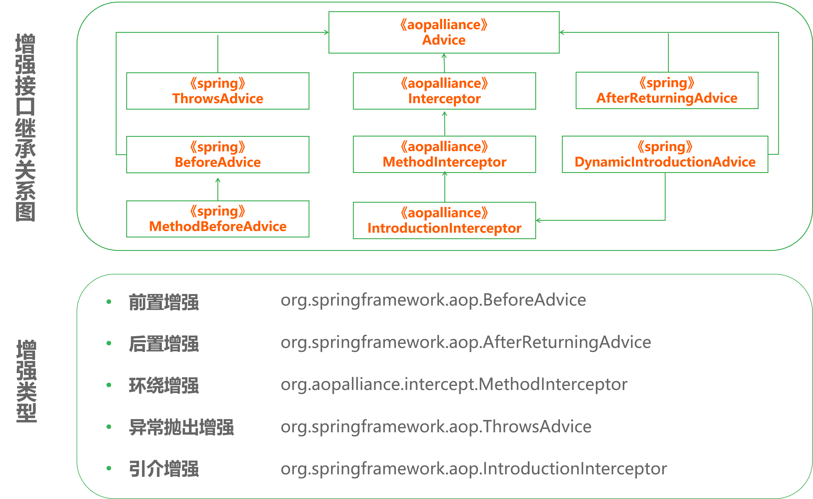
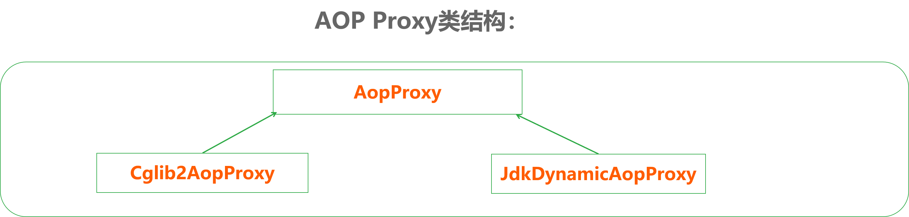

### 9. Spring：AOP之增强

1. Spring AOP的增强类型

   

2. Spring AOP的前置增强

   * 通过代码实现增强

     在Spring当中，仅支持方法级别的增强，利用MethodBeforeAdvice实现，表示在目标方法执行前实施增强，步骤如下：

     * 创建业务接口类：Waiter.java
     * 创建业务实现类：NativeWaiter.java
     * 创建业务增强类：GreetingBeforeAdvice.java
     * 创建增强测试类：TestAdvice.java

   * ProxyFactory介绍

     

     * JDK代理：

       ```java
       ProxyFactory pf = new ProxyFactory();
       pf.setInterfaces(target.getClass().getInterfaces());
       pf.setTarget(target);
       pf.addAdvice(advice);
       ```

     * CGLib代理

       ```java
       ProxyFactory pf = new ProxyFactory();
       pf.setInterfaces(target.getClass().getInterfaces());
       pf.setOptimize(true);
       pf.setTarget(target);
       pf.addAdvice(advice);
       ```

   * 通过配置文件实现增强

     * 配置文件：

       ```xml
       <bean id="greetingBefore"class=“……..GreetingBeforeAdvice" />①
       <bean id="target" class=“…….NaiveWaiter" />②
       <bean id="waiter" class="org.springframework.aop.framework.ProxyFactoryBean"
             p:proxyInterfaces=“…….Waiter" ③
             p:interceptorNames="greetingAdvice“④
             p:target-ref="target"⑤
       />

       ```

     * 常用可配置属性

       * target
       * proxyInterfaces
       * interceptorNames
       * singleton
       * optimize
       * proxyTargetClass

3. AOP的后置增强

   后置增强在目标方法调用后执行，例如上例中，在服务生每次服务后，也需要向客人问候，可以通过后置增强来实施这一要求

   * 步骤
     * 创建业务接口类：Waiter.java
     * 创建业务实现类：NativeWaiter.java
     * 创建业务增强类：GreetingAfterAdvice.java
     * 创建配置文件：conf-advice.xml
     * 创建增强测试类：TestAdvice.java

4. AOP的环绕增强

   环绕增强允许在目标类方法调用前后织入横切逻辑，它综合实现了前置，后置增强两者的功能

   * 步骤
     * 创建业务接口类：Waiter.java
     * 创建业务实现类：NativeWaiter.java
     * 创建业务增强类：GreetingInterceptor .java
     * 创建配置文件：conf-advice.xml
     * 创建增强测试类：TestAdvice.java

5. AOP的异常抛出增强

   异常抛出增强表示在目标方法抛出异常后实施增强，最适合的场景是事务管理，比如当参与事务的方法抛出异常后需要回滚事务

   * 示例

     * 创建业务实现类：ForumService.java
     * 创建业务增强类：TransactionManager.java
     * 创建配置文件：conf-advice.xml
     * 创建增强测试类：TestAdvice.java

   * 增强方法

     

6. AOP的引介增强

   引介增强是一种比较特殊的增强类型，它不是在目标方法周围织入增强，而是为目标创建新的方法和属性，所以它的连接点是类级别而非方法级别的

   * 示例
     * 创建接口类：Monitorable.java
     * 创建业务类：PerformanceMonitor.java
     * 创建增强类：ControllablePerformanceMonitor.java
     * 创建配置文件：conf-advice-introduce.xml
     * 创建增强测试类：TestIntroduce.java